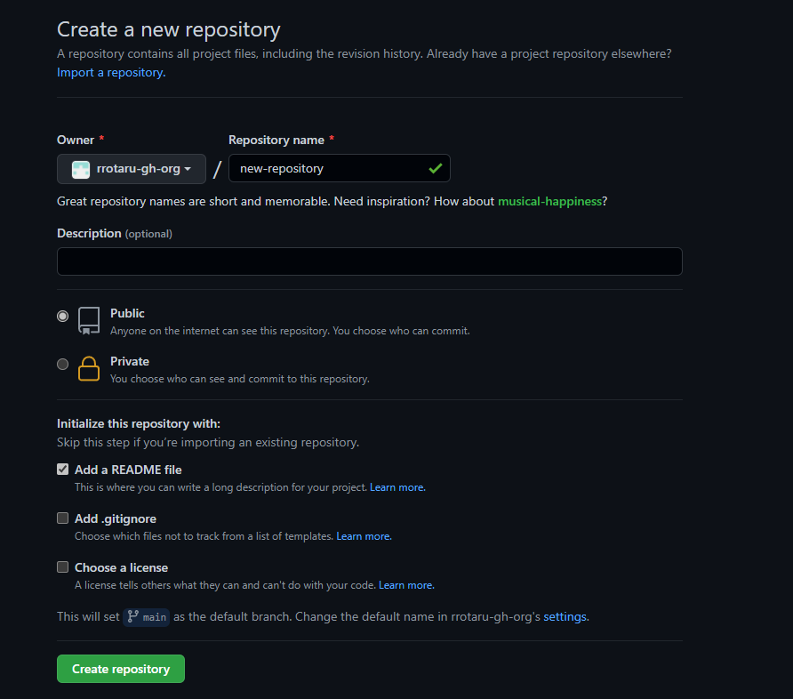
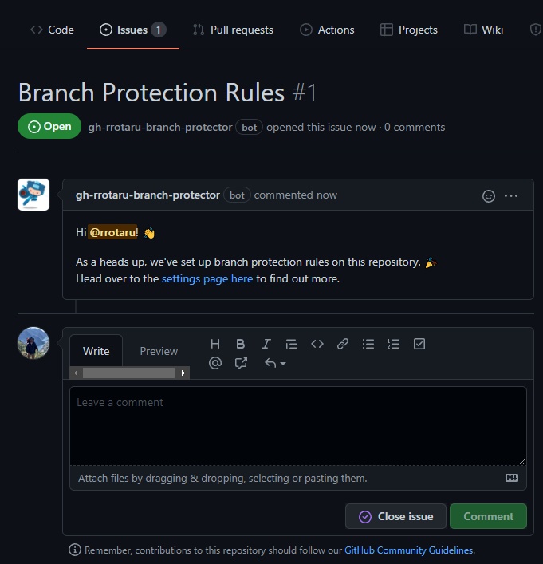
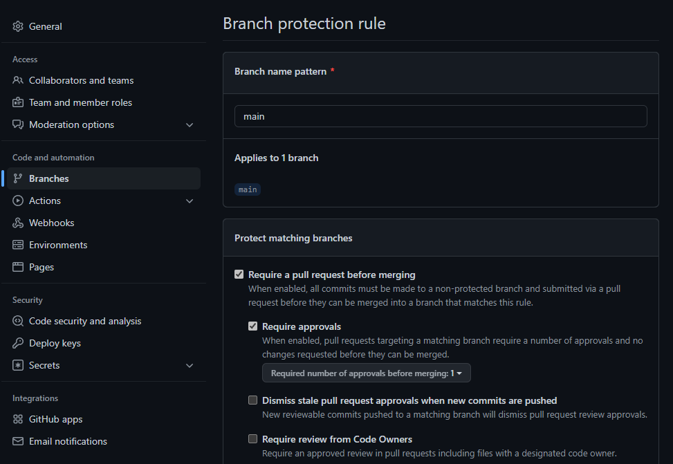

# Branch Protector

A GitHub app for automatically setting up branch protection rules on new repositories

### How it works

Every time a new repository is created in your organization, `Branch Protector` will update the repository's settings to enable a branch protection rule. This rule will require developers to create a pull request and receive at least one approval before merging code changes into the default branch.







### Setting up the GitHub App for your GitHub instance

You can follow the detailed documentation for [Creating a GitHub App](https://developer.github.com/apps/building-github-apps/creating-a-github-app/). Below is the condensed version of the documentation

1. On your GitHub instance, visit the `settings` page on the Organization that you want to own the **GitHub** App, and navigate to the `GitHub Apps` section.
    - You can access this page by visiting the following url:
    `https://<MY_GITHUB_HOSTNAME>/organizations/<MY_ORG_NAME>/settings/apps`
2. Create a new **GitHub App** with the following settings:
    - **Webhook URL**: URL of the machine on which this app has been deployed (Example: `http://ip.of.machine:3000`)
    - **Homepage URL**: URL of the machine on which this app has been deployed (Example: `http://ip.of.machine:3000`)
    - **Webhook Secret**: *REQUIRED* The webhook secret that will be or has been defined as an environment variable in your deployment environment as `WEBHOOK_SECRET`
    - **Permissions**:
        - Administration: **Read & Write**
        - Issues: **Read & Write**
    - **Events**:
        - Events: **Read only**
    - **Subscribe to Events**
        - Repository
        - Branch protection rule

3. Once these have been configured, select the `Create GitHub App` button at the bottom of the page to continue
4. Make a note of the `APP ID` on your newly-created **GitHub App**. You will need to set this as an environment variable when you configure the app.
5. Generate and download a private key from the new App page, and store it in your deployment environment. You can either do this by saving the contents of the key file as the environment variable `PRIVATE_KEY`, or by saving the file directly in the environment and specifying its path with the environment variable `PRIVATE_KEY_PATH`
6. After you have created the **GitHub** App, you will need to install it to the desired **GitHub** Organizations.
    - Select `Install App`
    - Select `All Repositories` or the desired repositories you wish to watch

### Deploying your own

`Branch Protector` is based on the **Probot** framework and can be deployed as a standard **NodeJS** application. Ensure that **NPM** is installed in your deployment environment. Also ensure that the following environment variables are configured.

```bash
# Clone repository to local machine
git clone https://github.com/rrotaru/branch-protector

# Change directories into code base
cd branch-protector

# Install all dependencies
npm install

# Create the .env configuration file and update with all needed variables
cp .env.example .env
vi .env
# update .env with configuration variables

# Run the bot
npm start

# Run the bot in the background and output to log
# there are other major ways to achieve this...
# https://github.com/unitech/pm2
# https://github.com/github/auto-fork-sync#running-with-systemd
# https://www.npmjs.com/package/forever
nohup npm start 2>&1 >> /path/to/output.log &
```

### Environment Variables

- `APP_ID` - The App ID of the **GitHub App**
- `BOT_NAME` - The name of the bot
- `WEBHOOK_SECRET` - The secret to prevent man in the middle attacks
- `GHE_HOST` - This is a required field for **GitHub Enterprise Server** implementations (_Example: github.mycompany.com_)

One of the following is **required**:
- `PRIVATE_KEY` - The contents of the private key for your **GitHub App**. If you're unable to use multi-line environment variables, use base64 encoding to convert the key to a single line string.
- `PRIVATE_KEY_PATH` - The path to the .pem file for your **GitHub App**.
  (Example: `PRIVATE_KEY_PATH='path/to/key.pem'`)

## How to use Branch Protector

Once you have the **GitHub App** up and running, users will simply need to create new repositories in the **GitHub Organization** and `Branch Protector` will take care of the rest.

## How to contribute

If you find any bugs or would like to contribute to more features, please check out our [issues](https://github.com/rrotaru/branch-protector/issues) page and [CONTRIBUTING](CONTRIBUTING.md) guide for more details.

## Special credits and thanks

- **Probot Framework**: https://github.com/probot/probot
- **Probot Settings app**: https://github.com/probot/settings
- **Rally + GitHub integration**: https://github.com/github/rally

## License

This project uses the [MIT License](LICENSE)